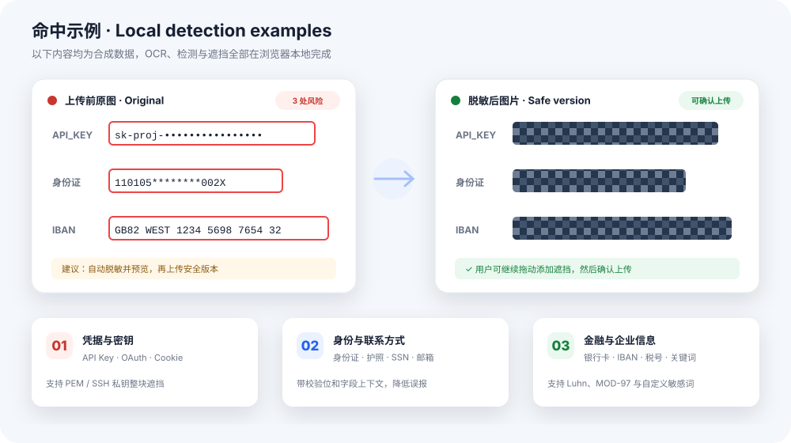

  

<h1 align="center">Privacy Guard Rails</h1>

  在图片进入 AI 对话之前，本地识别、确认并遮挡敏感信息。 
  本地 OCR · 无云端检测 API · 支持离线使用

  
  
  
  

  <strong>简体中文</strong> · <a href="./README.md">English</a>

---

Privacy Guard Rails 是一个 Manifest V3 浏览器扩展。在图片提交到 ChatGPT、
Claude、DeepSeek 或 Gemini 之前，它会拦截上传操作，通过本地 Tesseract OCR
提取文字，再使用校验码、正则表达式和上下文规则定位可能包含敏感信息的区域。

发现风险后，用户可以：

- 取消上传；
- 忽略警告，继续上传原图；
- 自动马赛克命中区域并预览结果；
- 在预览图上拖动补充遮挡区域，再上传安全版本。

> [!IMPORTANT]
> 本扩展是上传前的安全辅助工具，不是完整的企业级 DLP 系统。在敏感场景中使用前，
> 请先阅读[能力边界](#能力边界)。它不能保证识别出图片中的每一项敏感信息。

## 命中效果

  

图中全部为合成数据，不包含真实身份证号、银行账号或密钥。

## 核心流程

~~~mermaid
flowchart LR
    A["粘贴 / 拖拽 / 附件上传"] --> B["上传前拦截"]
    B --> C["本地 OCR English + 简体中文"]
    C --> D["规则、上下文与校验码"]
    D --> E{"发现风险？"}
    E -- 否 --> F["继续原上传流程"]
    E -- 是 --> G["双语确认界面 显示命中区域"]
    G --> H["取消"]
    G --> I["忽略并上传原图"]
    G --> J["自动脱敏并预览"]
    J --> K["手动补充遮挡"]
    K --> L["上传安全版本"]
~~~

## 能检测什么

当前引擎包含 **22 条结构化规则**、专用 PEM/SSH 私钥块处理、内置关键词和
用户自定义敏感词。

| 类别 | 当前覆盖范围 | 误报控制 |
|---|---|---|
| API 与云凭据 | OpenAI、Anthropic、AWS、Google、GitHub、JWT | 厂商前缀和长度约束 |
| 登录凭据 | OAuth、Access/Refresh Token、Bearer Token、Session Cookie | 字段上下文和 Token 格式 |
| 私钥与数据库 | PEM、RSA、EC、DSA、OpenSSH 私钥；数据库连接串 | 从 <code>BEGIN</code> 到 <code>END</code> 整块遮挡私钥 |
| 身份与联系信息 | 中国身份证、护照、美国 SSN、中国手机号、邮箱 | 身份证校验位、SSN 无效段过滤、字段上下文 |
| 企业标识 | 中国统一社会信用代码、税务识别号 | MOD 31-3 校验或字段上下文 |
| 金融信息 | 银行卡、银行账号、IBAN、BTC 与 ETH 地址 | Luhn、IBAN MOD-97、字段上下文 |
| 文档关键词 | 机密、内部文件、财务报表等 | 内置词库和用户自定义敏感词 |

护照号码、通用税务识别号和银行账号没有统一的全球格式。只有当 OCR 同时识别到
<code>Passport No</code>、<code>Tax ID</code>、<code>Bank Account</code>、
<code>护照号码</code>、<code>税号</code>或<code>银行账号</code>等附近字段名时，
这些内容才会被判定为风险。

## 支持的网站

| 网站 | 域名 | 粘贴 | 拖拽 | 附件按钮 |
|---|---|:---:|:---:|:---:|
| ChatGPT | <code>chatgpt.com</code> | ✓ | ✓ | ✓，包含 MAIN world 与 File System 路径 |
| Claude | <code>claude.ai</code> | ✓ | ✓ | ✓ |
| DeepSeek | <code>chat.deepseek.com</code> | ✓ | ✓ | ✓ |
| Gemini | <code>gemini.google.com</code> | ✓ | ✓ | ✓ |

网页应用会持续更新。浏览器或网站升级后，建议重新执行端到端上传测试。

## 本地隐私架构

~~~mermaid
flowchart TB
    subgraph PAGE["AI 对话页面"]
      M["MAIN world 附件选择拦截"]
      I["隔离的 content script 流程编排 + Shadow DOM UI"]
    end

    M <-->|"页面内桥接"| I
    I <-->|"chrome.runtime Port"| B["MV3 background service worker"]
    B <-->|"OCR 请求 / 结果"| O["Offscreen document"]
    O --> W["Tesseract Worker WASM SIMD LSTM"]
    W --> O
    I --> R["Canvas 马赛克 生成安全图片"]
~~~

- OCR 引擎：<code>tesseract.js 5.1.1</code>。
- 内置模型：<code>assets/tesseract/eng.traineddata.gz</code> 和
  <code>assets/tesseract/chi_sim.traineddata.gz</code>。
- OCR 前会将图片最长边缩放到 <code>1440px</code>；命中坐标随后映射回原图像素。
- 运行时检测不调用云端 OCR 或外部检测 API。
- 扩展权限为 <code>storage</code> 和 <code>offscreen</code>；content script 仅访问上表中的
  AI 对话域名。
- 只有用户明确选择继续后，扩展才会主动重新注入原图或脱敏后的图片。

<code>npm run setup</code> 会在初始化时下载约 30 MB 的英文和简体中文 OCR 模型。
模型保存在项目中后，运行时 OCR 可以离线工作。

## 安装

~~~bash
git clone <你的仓库地址>
cd pri_image
npm run setup
~~~

然后：

1. 打开 <code>chrome://extensions</code>；Edge 请打开 <code>edge://extensions</code>。
2. 开启**开发者模式**。
3. 点击**加载已解压的扩展程序**。
4. 选择项目根目录。
5. 打开受支持的网站，用合成测试图片分别验证粘贴、拖拽和附件上传。

修改源码后运行：

~~~bash
npm run build
~~~

在扩展管理页面点击**重新加载**。同时刷新已打开的聊天页面，让新的 content script
重新注入。

## 设置与交互

- 扩展弹窗支持中文和英文，并将界面语言保存在浏览器本地存储中。
- 可以全局暂停保护，也可以按网站启用或关闭。
- OCR 可加载英文、简体中文或同时加载两种语言。
- 用户可以配置检测严格度和组织自定义敏感词。
- 网页内的风险确认和脱敏预览会跟随弹窗语言。
- 自动脱敏后，用户可以继续手动画框、撤销修改，并确认上传最终版本。

## 验证

~~~bash
npm run test:scan       # 20 组规则正例与反例
npm run test:popup      # 弹窗中英文词典完整性
npm run test:overlay    # 确认界面翻译和区域标签完整性
npm run test:ocr -- /path/to/test-image.jpg
npm run build
~~~

当前规则测试包括：

~~~text
PASS  PEM private key block
PASS  OAuth access token
PASS  Session cookie
PASS  Database connection string
PASS  US SSN / invalid SSN
PASS  IBAN / invalid IBAN checksum
PASS  Chinese unified social credit code / invalid checksum
PASS  Date must NOT match
PASS  Long random digits must NOT match
...
20/20 passed
~~~

## 项目结构

~~~text
pri_image/
├── assets/tesseract/          # WASM、Worker、英文 / 简体中文 OCR 模型
├── docs/                      # README 可视化资源
├── src/
│   ├── background/            # Offscreen 生命周期和 OCR 消息转发
│   ├── content/               # 上传拦截、双语确认 UI、脱敏预览
│   ├── engine/                # OCR 客户端和 Canvas 马赛克
│   ├── offscreen/             # Tesseract Worker 执行环境
│   ├── popup/                 # 双语扩展设置
│   └── shared/                # 配置、检测规则和校验码
├── scripts/                   # 模型初始化和可运行检查
├── manifest.json
└── esbuild.mjs
~~~

## 能力边界

1. **OCR 可能漏读或误读。** 模糊、旋转、反光、低对比度、复杂背景和过小文字都会降低
   准确率。OCR 没有读出的文字不会进入规则引擎。
2. **当前错误策略是 fail-open。** OCR 初始化或执行失败时，原图会被放行，因此不适合作为
   强制合规网关。
3. **一次选择仅完整处理第一张图片。** 多图片上传仍需专门支持。
4. **引擎理解文字，不理解视觉对象。** 人脸、签名、指纹、车牌、证件头像、二维码和
   条形码目前无法可靠识别。
5. **没有跨行语义模型。** 同一行中被 OCR 拆开的词可以重组，但跨行的地址、密钥或账号
   可能漏检；PEM/SSH 私钥块是专门处理的例外。
6. **上下文规则存在地域限制。** SSN 当前指美国号码；护照、税号和银行账号规则依赖
   中英文标签，无法覆盖所有国家和地区。
7. **网站上传实现可能变化。** 涉及 <code>event.isTrusted</code>、Shadow DOM、File System API
   或其他前端行为的更新可能影响重新注入，需要真实浏览器回归测试。
8. **尚未显式清理 EXIF。** 生成的 PNG 脱敏图通常不会保留源图片 EXIF，但选择“忽略并
   上传原图”时会保留原始元数据。

## 路线图

- [x] 粘贴、拖拽和附件按钮上传拦截
- [x] 本地英文与简体中文 OCR，并返回敏感区域坐标
- [x] 自动马赛克、结果预览和手动补充遮挡
- [x] 中英文扩展弹窗与网页内确认界面
- [x] API 凭据、私钥、身份、税务和金融规则
- [ ] 多图片处理
- [ ] 可选 fail-closed 策略
- [ ] 显式移除 EXIF 元数据
- [ ] 二维码和条形码解析
- [ ] 人脸、签名和车牌检测
- [ ] 基于真实浏览器端到端流程录制演示 GIF

---

使用 <code>tesseract.js</code> 和 <code>esbuild</code> 构建。本项目与 OpenAI、Anthropic、
DeepSeek 或 Google 无关联。
