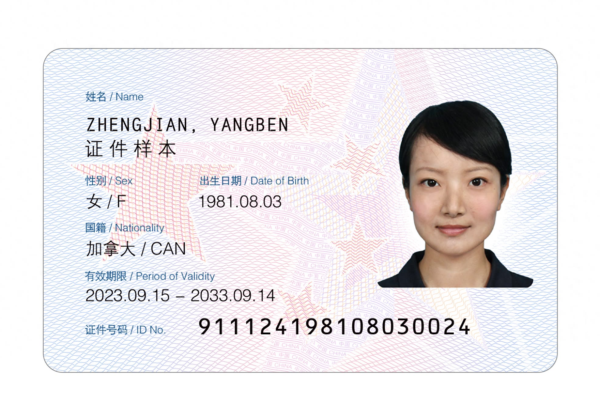
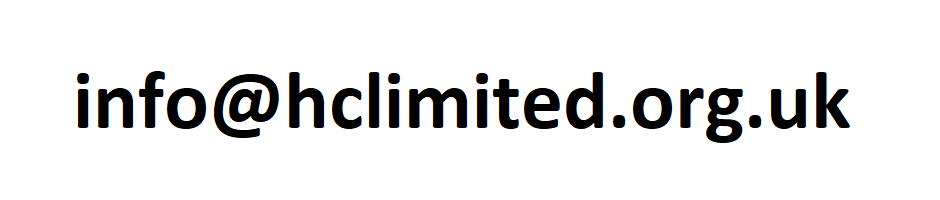
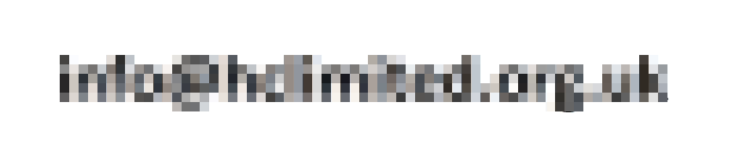
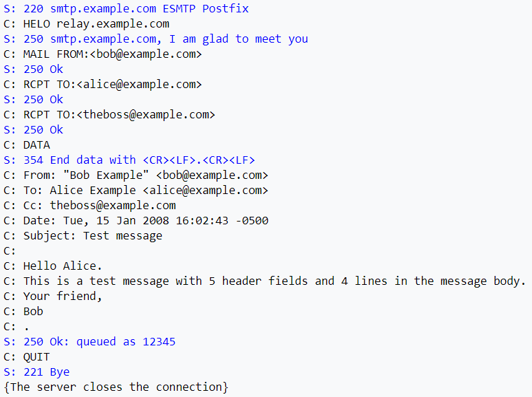
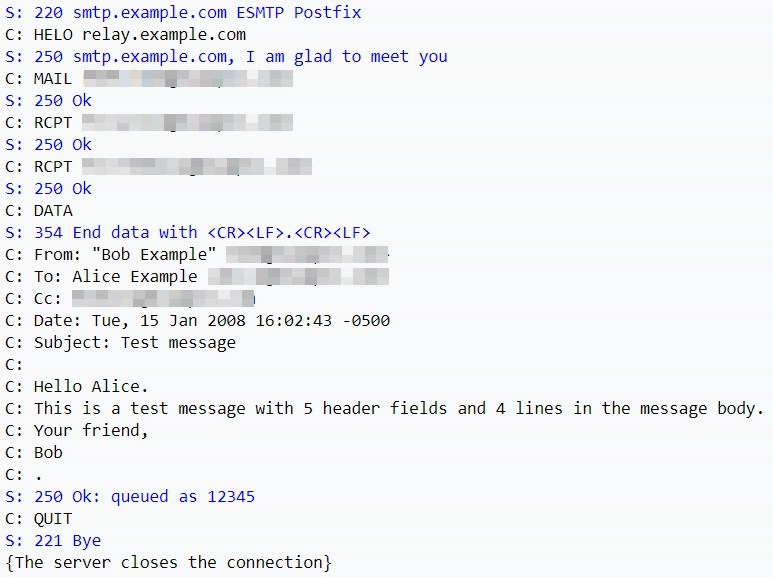
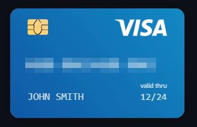

  

<h1 align="center">Privacy Guard Rails</h1>

  在图片进入 AI 对话前，本地识别并遮挡敏感文字。 
  本地 OCR · 无云端检测 API · 安装后可离线运行

  
  
  

  <strong>简体中文</strong> · <a href="./README.md">English</a>

Privacy Guard Rails 是一个面向 ChatGPT、Claude、DeepSeek 和 Gemini 的
Manifest V3 浏览器扩展。它会拦截粘贴、拖拽或附件上传的图片，在本地运行
Tesseract OCR，再通过格式、上下文和校验码检测敏感文字。

发现风险后，用户可以取消、上传原图，或预览自动马赛克结果，手动补充遮挡后再上传。

> [!IMPORTANT]
> 本扩展是上传前安全辅助工具，不是企业级 DLP 系统。OCR 和规则可能漏检；
> 在敏感场景使用前请阅读[能力边界](#能力边界)。

## 主要能力

- 本地英文和简体中文 OCR；图片不会发送到云端检测 API。
- 支持四个 AI 对话平台的粘贴、拖拽和附件按钮上传。
- 中英文插件弹窗、风险确认和脱敏预览。
- 自动马赛克，以及上传前的手动画框和撤销。
- 检测凭据、私钥、身份信息、联系方式、金融信息、加密货币地址和自定义关键词。

护照、税号和银行账号等通用格式，仅在附近存在中英文标签时命中。银行卡、
中国身份证、IBAN 和统一社会信用代码会执行校验码验证。

## 检测样例

以下图片均由当前版本的本地 OCR 和规则引擎按默认检测等级实际处理。来源和许可见
[样例图片署名说明](./docs/examples/ATTRIBUTION.md)。

<table>
  <thead>
    <tr><th>来源图片</th><th>脱敏结果</th></tr>
  </thead>
  <tbody>
    <tr>
      <td></td>
      <td></td>
    </tr>
    <tr>
      <td></td>
      <td></td>
    </tr>
    <tr>
      <td></td>
      <td></td>
    </tr>
    <tr>
      <td></td>
      <td></td>
    </tr>
  </tbody>
</table>

可复现结果：1 个通过校验的中国身份证号、1 个企业邮箱、6 个 SMTP 示例邮箱，
以及 1 个通过 Luhn 校验的 Visa 测试卡号。

## 工作流程

~~~mermaid
flowchart LR
    A["粘贴 / 拖拽 / 附件"] --> B["拦截图片"]
    B --> C["本地 OCR"]
    C --> D["规则 + 校验码"]
    D --> E{"发现风险？"}
    E -- 否 --> F["继续上传"]
    E -- 是 --> G["用户确认"]
    G --> H["马赛克 + 手动补充"]
    H --> F
~~~

OCR 在扩展的 offscreen document 中运行，使用内置的 Tesseract WASM 与
`eng` / `chi_sim` 模型。图片最长边会缩放到 1440 px 用于 OCR，命中坐标随后
映射回原图。

## 支持网站

| 网站 | 域名 | 粘贴 | 拖拽 | 附件上传 |
|---|---|:---:|:---:|:---:|
| ChatGPT | `chatgpt.com` | ✓ | ✓ | ✓ |
| Claude | `claude.ai` | ✓ | ✓ | ✓ |
| DeepSeek | `chat.deepseek.com` | ✓ | ✓ | ✓ |
| Gemini | `gemini.google.com` | ✓ | ✓ | ✓ |

网页上传实现会变化，浏览器或网站大版本更新后应重新测试。

## 安装

### 使用发布包

1. 从 [GitHub Releases](https://github.com/donghan22/redact-before-send/releases)
   下载并解压最新 ZIP。
2. 打开 `chrome://extensions` 或 `edge://extensions`。
3. 开启**开发者模式**，点击**加载已解压的扩展程序**，选择包含
   `manifest.json` 的解压目录。

发布包已包含编译代码和全部 OCR 运行文件。

### 从源码构建

~~~bash
git clone https://github.com/donghan22/redact-before-send.git
cd redact-before-send
npm run setup
~~~

将项目根目录作为未打包扩展加载。修改源码后运行 `npm run build`，重新加载扩展，
并刷新已经打开的对话页面。

`npm run setup` 会安装依赖、下载约 36 MB 的固定版本 OCR 资源、校验文件大小和
SHA-256，然后构建扩展。

## 验证与打包

~~~bash
npm test
npm run verify:assets
npm run test:ocr -- /path/to/image.jpg
npm run build
npm run package:extension
~~~

可安装 ZIP 会生成到 `release/`。CI 会执行相同的资源、测试、构建和打包检查。

## 项目结构

~~~text
assets/                 图标和生成的 Tesseract 运行资源
docs/                   README 图片与署名信息
src/background/         Offscreen 生命周期与 OCR 转发
src/content/            上传拦截和网页内确认界面
src/engine/             OCR 客户端与 Canvas 马赛克
src/offscreen/          Tesseract Worker 运行环境
src/popup/              中英文扩展设置
src/shared/             配置、检测规则与校验码
scripts/                资源、测试与发布脚本
manifest.json           Chrome MV3 配置
esbuild.mjs             扩展打包入口
~~~

## 发布版本

保持 `manifest.json`、`package.json` 和 `package-lock.json` 中的版本一致，
然后推送对应标签：

~~~bash
git tag -a v0.1.4 -m "Privacy Guard Rails v0.1.4"
git push origin v0.1.4
~~~

发布工作流会生成 `privacy-guard-rails-v<版本号>.zip`。

## 能力边界

- OCR 可能漏读模糊、旋转、反光、低对比度或过小的文字。
- OCR 失败时当前采用 fail-open 策略，会放行原图。
- 一次多图片选择仅完整处理第一张图片。
- 无法可靠检测人脸、签名、指纹、证件头像、车牌、二维码和条形码。
- 跨行内容和未覆盖的地区格式可能漏检。
- 忽略警告会上传带有原始元数据的原图。
- 网站前端更新可能影响拦截或重新注入。

## 许可证

[MIT](LICENSE)

使用 `tesseract.js` 和 `esbuild` 构建。
